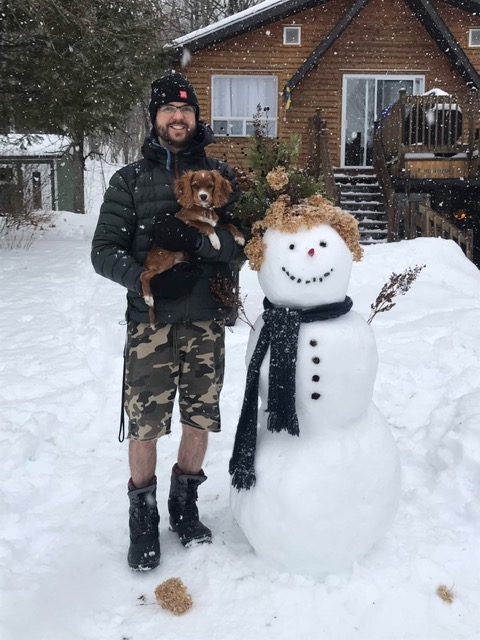

# Michael Otterstedt

## About

- occupation: sre at SAP
- origin: .se 🇸🇪
- current: .ca 🇨🇦

### Hobby
- Hiking
- Camping
- Skiing (Alpine, Cross Country, Alpine Touring)
- Otternet
- Carpentry

## IT

From C64 gaming in the eighties, to programming in the nineties, to Java application platform integration in the zeros, to IoT in the tens, to reliability engineering in the twenties.

My main interests are around IoT, reliability, integration etc. and how to make it automatically take care of itself and do what you tell it to. Monitor and automate. Strive for perfection and enjoy the ride while not getting there.

Exclusively working in Linux server environments.

### Companies
- Drutt
- Ericsson
- Evry
- CN
- SAP

### Universities
- Chalmers Lindholmen
- Chalmers

